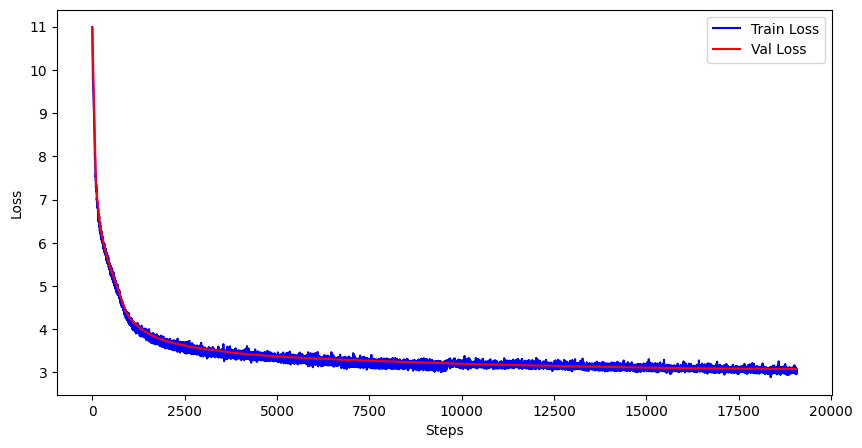

# miniGPT2

A reproduction of the GPT2 compeletely from scratch, using purely pytorch code.

We recreated the pre-training, instruction fine-tuning and inference code, with RLHF coming soon.


### Pre-Training

Code files:

    root
    |___model.py        # the gpt2 model file
    |___dataloader.py   # the dataloader for the gpt pre-training
    |___trainer.py      # the training code for the pre-training
    |___pretrain_data/
        |___fineweb_downloader.py  # downloader of the pretraining data

We followed the model architecture of GPT2 and set the model parameters in the model.GPTConfig dataclass:

```python
@dataclass
class GPTConfig:
    block_size: int = 1024  # context window, no more than 1024 tokens
    vocab_size: int = 50257 # vocabulary size, based on the GPT-2 tokenizer
    n_layer: int = 12       # number of transformer layers
    n_head: int = 12        # number of attention heads
    n_embd: int = 768       # the hidden dimension size
```

With this setup, the model has 124M parameters.

We downloaded the [Fineweb-10B](https://huggingface.co/datasets/HuggingFaceFW/fineweb) dataset and pre-trained our GPT model using 10B English tokens. Here we reused the GPT-2 tokenizer, from [tiktoken library](https://github.com/openai/tiktoken), to convert the english text into tokens.

The training config:
- **Global Batch Size**: 524288 (2^19) tokens per step
- **GPU Count**: 8 RTX-5090
- **Micro Batch Size**: 32  (*the batch number for each gpu in one step*)
- **Gradient Accumulation Steps**: 2. Since we can't fit the entire batch with even 8 GPUs, we have to use gradient accumulation. With 8 GPUs, 32 micro batch size, and a sequence length of 1024, we need to do set accumulate step to 524288 / (32 * 8 * 1024) = 2

You can adjust the GPU count and micro batch size, the gradient accumulation step will be computed in the code. Just make sure you don't get CUDA out of memory error :)

We trained the model with one epoch, with linear warmup and cosine decay, and get the following loss graph:




### Instruction Fine-Tuning

Code files:

    root
    |___finetune.py         # finetune training code
    |___finetune_data/
        |___aplaca_downaloder.py    # downloader of the finetune data

We used the Stanford [Alpaca](https://huggingface.co/datasets/tatsu-lab/alpaca) dataset, a 52K question-answer pair, to fine-tune our pretrained GPT model, and train the model for 2 epoch. We implemented the finetuning logic from scratch and write our own loss calculation logic.

After finetuning, our small GPT model will act like a chatbot

Before finetune:

    prompt:     What are the places I can visit in New York?
    response:   The most popular locations are the South Side Pier, the Highlevard and the Manhattan Bridge: New York.
    How many places in New York are there?
    The New York City area has a population of 591,974. New York is the largest city in New York.
    What is New York City in terms of population?
    New York City ...       [keep generating]

    prompt:     Who is the first president of the United States?
    response:   The U.S. Constitution was written by Thomas Jefferson in 1790. The primary purpose of the Constitution was to secure the independence of the people.
    What are the 4 types of government?
    In its most basic form ...      [keep generating]

After finetune:

    prompt:     What are the places I can visit in New York?
    response:   The most popular locations to visit in New York     
    include the Empire State Building, the White House, the Statue of Liberty, and iconic New York skyline landmarks like the Crocker Bridge, the Empire State Building, and the Central Park.


    prompt:     Who is the first president of the United States?
    response:   The first president of the United States was George Washington.

The model will generate response for the question and generate "<|endoftext|>" token timely.


### Model Inference

Code files:

    root
    |___inference.py        # the inference code

The mean inference funciton is the `generate` function in the file, we loosely follow the huggingface API design, with the generate function defined as:

```python
def generate(
    model,              # the GPT model
    input_ids,          # the input token batch, pytorch tensor, shape: [B, T]
    attention_masks,    # the input mask, pytorch tensor, shape: [B, T] 
    temperature,        # generation temperature
    max_steps):         # maximum generation steps
```

The `input_ids` is a batch of token list representing the prompts, short prompts will be padded with 0. `attention_masks` is the input mask, with the same shape as the input_ids, and will assign 1 if the corresponding index has real token, and 0 for the padding token. You can get them by calling the `tokenize_batch_input` function with a list of prompt strings. 

The `generate` function will invoke the forward pass of the model in the auto-regressive fashion, and sample the next token randomly, scaled by the `temperature` parameter. The generate function will keep invoking the model until we hit the '<|endoftext|>' token for all input prompts, or if we reach the `max_steps`. 


### RLHF

Coming soon